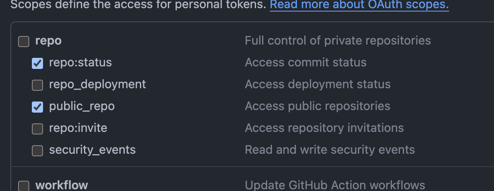

[](./LICENSE)
[](https://pkg.go.dev/github.com/kokoichi206/go-git-stats)
[](http://goreportcard.com/report/kokoichi206/go-git-stats)
[](https://github.com/kokoichi206/go-git-stats/releases)

# go-git-stats

CLI tool for git statistics

## COMMANDS

### _repo_

Get all repositories.

```sh
# When Github access token is set to GGS_TOKEN (environment variable)
$ echo $GGS_TOKEN
> ghp_....

# Repositories for authenticated user with Github access token
$ ggs repo
# abbreviation command
$ ggs r

# Public repositories without Github access token
$ ggs repo -name kokoichi206
$ ggs r -n kokoichi206
```

### _stats_

Get statistics of a specific repository.

```sh
# You need to set Github access token to GGS_TOKEN (environment variable)
# if you want to get private repopsitory stats.
$ echo $GGS_TOKEN
> ghp_....

$ ggs stats -name kokoichi206/go-git-stats
# abbreviation command
$ ggs s -name kokoichi206/go-git-stats
```

### _lines_

Get lines of codes you wrote before.

```sh
# You need to set Github access token to GGS_TOKEN (environment variable)
# if you want to get private repopsitory stats.
$ echo $GGS_TOKEN
> ghp_....
# with access token
$ ggs lines
> 11930741

$ ggs lines -name kokoichi206
> 10452117
# abbreviation command
$ ggs l -n kokoichi206
> 10452117
```

## INSTALLATION

Built binaries are available from GitHub Releases.

https://github.com/kokoichi206/go-git-stats/releases

### How to install

If you have Go environment, you can install via `go install`.

``` sh
go install github.com/kokoichi206/go-git-stats/cmd/ggs@latest
```

**MacOS, Linux**

```sh
curl -Lsf https://raw.githubusercontent.com/kokoichi206/go-git-stats/main/_tools/scripts/installer.sh | bash
```

### Get Access Token

Following [this document](https://docs.github.com/en/authentication/keeping-your-account-and-data-secure/managing-your-personal-access-tokens#personal-access-tokens-classic), you can get personal access token (classic) which starts from `ghp_`.

**Required scopes**

- repo:status
- public_repo



### How to set environment varialbe

**MacOS, Linux**

```sh
# Write these two commands to .bashrc, .zshrc or etc. if you want.
$ GGS_TOKEN=ghp_xxx
$ export GGS_TOKEN

# easier way
$ GGS_TOKEN=ghp_pienpoyon ggs <sub-command>
```

## LICENSE

under [MIT License](./LICENSE).
